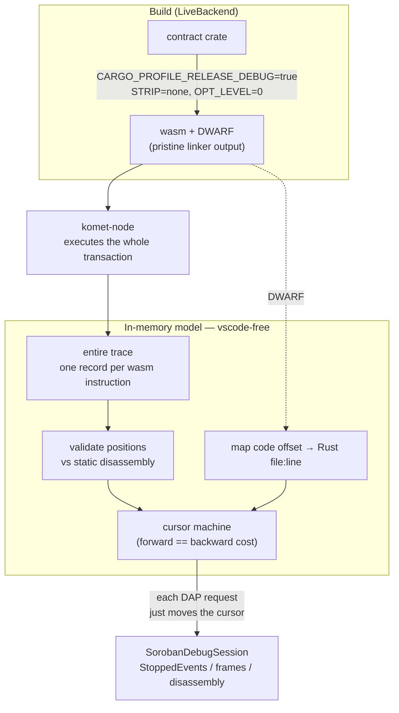

# Contributing

> **Audience:** `contributor` · `maintainer`
>
> **TL;DR:** How to hack on the extension — set up a dev environment
> (devcontainer or by hand), the everyday build/lint/test commands, the
> test-first convention and how to regenerate fixtures, and a tour of how the
> trace-replay adapter works internally (architecture map included).

Thanks for your interest in improving the Soroban Debugger! This document covers
how to get a development environment running and the conventions we follow.

## Development setup

The quickest path is the included **devcontainer**, which installs the full
toolchain — Rust with the wasm targets, the Stellar CLI, and `komet-node` (via
`kup install komet-node`, which also pulls the K toolchain and prebuilt
semantics). Open the repo in VSCode and choose *Reopen in Container*, or use the
GitHub Codespaces button. See [`.devcontainer/Dockerfile`](.devcontainer/Dockerfile).

To set things up by hand instead, you need:

- **Node.js** ≥ 22
- For the live pipeline only: a Rust toolchain with the `wasm32v1-none` (or
  `wasm32-unknown-unknown`) target, the [Stellar CLI](https://developers.stellar.org/docs/tools/cli),
  and [`komet-node`](https://github.com/runtimeverification/komet-node).

Then:

```bash
npm install
```

## Everyday commands

```bash
npm run build        # bundle to dist/extension.js (esbuild)
npm run watch        # rebuild on change
npm run check-types  # tsc --noEmit
npm run lint         # eslint
npm test             # recompile src+test to out/, then mocha (~4 min)
```

`npm test` clears `out/` before compiling: `tsc` leaves the output of a deleted
or renamed source behind, and a stale `out/test/*.test.js` keeps being collected
by mocha long after its source is gone.

Press **F5** (*Run Extension*) to open an Extension Development Host with the
extension loaded and the [`examples/`](examples/) workspace open. Pick a
configuration from the Run and Debug view — the **Replay … with symbols**
configs need no toolchain at all.

## Testing conventions

- **Write tests first.** New behavior should arrive with a failing test that
  describes it, then the implementation that makes it pass. The suite is the
  contract; keep it green (`npm test`) before opening a PR.
- Replay logic is deliberately free of the `vscode` API so it can be unit-tested
  in plain Node. Keep `vscode`-only code in `extension.ts`.
- Tests run automatically in [CI](.github/workflows/ci.yml) on every push and
  pull request (Node 22): type-check, lint, build, and test.

### Regenerating fixtures

The DWARF/trace fixtures under `test/fixtures/` are real build + trace outputs
and must stay matched: a trace's `pos` values are byte offsets into that exact
wasm, so a wasm and its trace only mean anything **as a pair**. One script
rebuilds every pair and re-checks each one:

```bash
scripts/make-fixtures.sh   # build the debug wasms, capture matching traces, verify
```

It needs the full toolchain (Rust + Stellar CLI + komet-node). Under the hood:

- `scripts/capture-trace.mjs --wasm … --function … --args-json '{"a":1}'` runs one
  contract call through the real pipeline and writes the node's records verbatim,
  so a fixture keeps its `kind` tags, VM event payloads, memory and globals.
- `scripts/verify-addresses.mjs --wasm … --trace …` re-derives the address
  convention the whole debugger rests on (komet's `pos`, the DWARF line
  addresses and the disassembly all being code-section-payload-relative, with no
  delta). Worth running on its own after a komet-node or rustc upgrade.

## How it works

The debug adapter is a **trace-replay cursor machine**. [komet-node](https://github.com/runtimeverification/komet-node)
executes a whole transaction and returns the *entire* execution trace — one
record per WebAssembly instruction — and the adapter loads that into an
in-memory model and services every DAP stepping request by moving a cursor.
Because the whole recording is in memory, stepping *backward* is just as cheap
as stepping forward. The adapter runs in-process in the extension host
(`DebugAdapterInlineImplementation`).


```mermaid
flowchart TB
    subgraph build["Build (LiveBackend)"]
      CRATE["contract crate"] -->|"CARGO_PROFILE_RELEASE_DEBUG=true<br/>STRIP=none, OPT_LEVEL=0"| WASM["wasm + DWARF<br/>(pristine linker output)"]
    end
    WASM --> KOMET["komet-node<br/>executes the whole transaction"]
    KOMET --> TRACE["entire trace<br/>one record per wasm instruction"]

    subgraph model["In-memory model — vscode-free"]
      TRACE --> VAL["validate positions<br/>vs static disassembly"]
      WASM -. "DWARF" .-> MAP["map code offset → Rust file:line"]
      VAL --> CUR["cursor machine<br/>(forward == backward cost)"]
      MAP --> CUR
    end

    CUR -->|"each DAP request<br/>just moves the cursor"| DAP["SorobanDebugSession<br/>StoppedEvents / frames / disassembly"]
```

A `rawTrace` replay skips the *Build* and *komet-node* stages entirely — the
JSONL trace is loaded straight into the model (and a paired `wasmPath` still
feeds the DWARF/disassembly seams).

- **The build injects debug info without touching your `Cargo.toml`.** It sets
  `CARGO_PROFILE_RELEASE_DEBUG=true` / `CARGO_PROFILE_RELEASE_STRIP=none` for
  `stellar contract build`, so the wasm carries DWARF. The **pristine linker
  output** (`target/…/release/deps/*.wasm`) is what gets uploaded, because the
  Stellar CLI's metadata-injection step rewrites the wasm and strips the DWARF
  line programs.
- **DWARF → Rust.** An in-repo DWARF v4/v5 line-table parser (`src/dwarf/`) maps
  wasm code offsets to Rust `file:line`. Breakpoints set in Rust source verify
  against the executed trace (sliding forward to the nearest executed line).
- **No-DWARF fallback.** A prebuilt wasm without debug info — or a `rawTrace`
  replay without `wasmPath` — degrades gracefully to disassembly-only debugging:
  frames carry an instruction pointer but no source.
- **Positions are validated.** komet-node's `pos` is relative to the section
  being executed (e.g. the code section for function code, the globals section
  for global initializers), so every record is cross-checked against the static
  disassembly and only trusted when the mnemonics agree. komet-node's tracer
  stops at instructions it cannot decode (printing them as `unknown`, e.g.
  `if`), so a trace can be a prefix of the full execution.

### Architecture

```
extension.ts            VSCode glue: config provider + inline adapter factory
debugAdapter/
  SorobanDebugSession   the DAP conversation and nothing else: each request is
                        one call into the modules below plus an event
  stopModel.ts          a trace's stop points: validated positions, visible
                        records, call depths, statement stops (shared with the CLI)
  replayCursor.ts       the stepping engine — every forward/reverse move and the
                        breakpoint resolution, as cursor moves over a StopModel
  stops.ts              the pure derivations stopModel is built from (depths,
                        line runs, S17/S18/S21 stop filtering)
  TraceModel            records + replay cursor; owns the two state images below,
                        built lazily and shared by every consumer
  MemoryImage           linear memory at a cursor (snapshot-on-change index)
  LedgerImage           Stellar ledger at a cursor: storage/TTLs, balances,
                        ledger info, host objects, call stack, and the executing
                        contract; undoes the writes of a trapped sub-call
                        (docs/state-inspection.md)
  artifacts.ts          wasm bytes -> { mapper, disassembly, validated positions }
  ledgerView.ts         the ledger presentation both front ends share: one
                        snapshot per stop, as a lazy ChildVar tree
  wasmView.ts           the Locals / Value Stack / Globals scopes, same shape
  disassemblyView.ts    the Disassembly View rows for one window of addresses
  backends/
    RawTraceBackend     replay a JSONL trace file (+ optional wasmPath for symbols)
    LiveBackend         turnkey build + spawn + deploy + trace (config + runner
                        from pipeline/)
komet/
  trace.ts              JSONL -> TraceRecord[] (K-style mnemonics, section-relative pos)
  traceEvents.ts        Soroban VM event payloads -> TraceEvent (a malformed or
                        unknown payload degrades to no event, never fails a session)
  mnemonics.ts          K-style instr arrays -> wasm mnemonics ('i64.const 255')
  KometClient.ts        JSON-RPC client (getHealth/sendTransaction/traceTransaction/...)
  KometProcess.ts       spawns/stops the node as a process group
pipeline/
  config.ts             launch config -> canonical { steps, trace } (validated)
  SequenceRunner.ts     runs that sequence against one accumulating ledger, then
                        resolves the traced tx into a ResolvedTrace
cli/                    the argv tokenizer + exit-code shell both CLIs share
soroban/specEncode.ts   invoke args -> ScVals, encoded against the contract's own
                        contractspecv0 spec; `${...}` substitution
soroban/scvalJson.ts    trace ScVal JSON -> DecodedValue (display + lazy children)
soroban/strkey.ts       raw address bytes -> C…/G… strkey (SDK-free: the SDK costs
                        ~8s of module load inside the adapter, which alone blows
                        the DAP handshake)
wasm/
  sections.ts           wasm section walker (offsets, custom-section lookup)
  Disassembly.ts        static disassembly (wasmparser), code-offset addressed
dwarf/                  DWARF v4/v5 .debug_line/.debug_info parser -> LineTable
sourcemap/
  SourceMapper          the mapping seam the adapter talks to
  DwarfSourceMapper     trace index / code offset -> Rust file:line (+ breakpoints)
  NullSourceMapper      no-DWARF fallback (disassembly-only)
```

All replay logic is free of the `vscode` API, so it can be unit-tested in plain
Node; the `vscode`-only glue lives in `extension.ts`. For a deep dive on the
stepping model, see [`docs/stepping.md`](docs/stepping.md).

## Pull requests

- Branch off `main` and keep PRs focused on a single change.
- Make sure `npm run check-types`, `npm run lint`, and `npm test` all pass.
- Write clear commit messages that explain the *why*, not just the *what*.
- Update the [CHANGELOG](CHANGELOG.md) under *Unreleased* for user-facing changes.

## Reporting bugs

Because the debugger replays a captured trace, a JSONL trace file is often the
most useful thing to attach to a bug report — it reproduces a session with no
toolchain or node required (`rawTrace` in a launch config). See the issue
templates when you open an issue.
