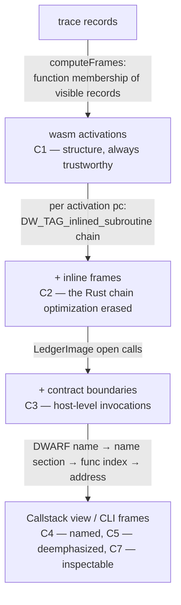

# Call stack semantics

> **Audience:** `contributor` · `maintainer` (frames, Callstack view)
>
> **TL;DR:** What the Callstack view shows and why it can be trusted at any optimization level. Frame STRUCTURE always comes from the trace's own wasm activations (C1); DWARF adds the Rust frames inlining erased (C2); the trace's contract boundaries close the stack at the bottom (C3). Names come off a precision ladder — DWARF, then the `name` section, then the function index, then the address (C4) — so a frame is never nameless and never labelled with something less precise than the build made available. The numbered rules C1–C8 are pinned by `test/callStack.test.ts` and `test/dapFrames.test.ts`.

Where the rules live in the code: the activation reconstruction is `computeFrames` in `src/debugAdapter/stops.ts` (assembled into the `StopModel`, so stepping and frames share one derivation); the inline chain is `ScopeIndex.inlineScopesAt` behind `VariableResolver.inlineFramesAt`; the assembly of the three sources into frames is `src/debugAdapter/callStack.ts`, which both `SorobanDebugSession.stackTraceRequest` and the CLI's `projectSourceStop` call. Every one of those is pure and unit-tested without a DAP client.

## Why not "Rust frames OR wasm frames"

A recorded trace and a DWARF section disagree about what a frame is, and both are right about different things:

- The **trace** knows exactly which wasm function bodies are active. It cannot know that four Rust functions were inlined into one of them.
- **DWARF** knows the Rust call chain the programmer wrote. Its line table and inline records are only as complete as the optimizer left them.

So the view does not pick one. It takes the **structure** from the trace, which can never be wrong about the number of live activations, and takes **identity, position and inline depth** from the most precise source available at each frame. That is what makes the same view usable across build settings:

| build | what the stack shows |
| --- | --- |
| opt-0 + DWARF (what the debugger builds by default) | Rust frames one-to-one with activations, plus the occasional `#[inline(always)]` frame; every frame located in the user's source |
| optimized + DWARF | fewer activations, with the erased Rust chain restored as inline frames (C2) — the whole chain is still named and located |
| no DWARF (release, `debugInfo: false`, stripped) | one frame per activation, named from the demangled `name` section, positioned by code offset (C4) |
| no wasm at all (`rawTrace` replay) | one frame per activation from the opcode walk, addressed but unnamed |

## Rules

- **C1** (activations are the structure): the frames of a stack are, innermost first, the reconstructed wasm activation stack at the cursor — `computeFrames`, the same walk `depths` is projected from.
  The number of activation frames is therefore always `depth + 1`, so the Callstack view and `next`/`stepOut` can never disagree about what frame the cursor is in.
  An activation is positioned at the record it is executing: the cursor's record for the innermost frame, and for an outer frame the `call` instruction that entered the frame below it — which is what a caller frame reports in every debugger.
  Without function-body ranges (wasm-less replay) the opcode walk supplies the same structure, minus function identity.
- **C2** (inline frames): when DWARF is present, each activation's pc is expanded through the `DW_TAG_inlined_subroutine` instances covering it, and each becomes a frame ABOVE the activation.
  Positions shift by one along the chain: the innermost frame stands where the line table points, and every frame below it stands at its callee's `DW_AT_call_file`/`DW_AT_call_line` — the line the inlined call was written on.
  Without this, a frame would carry the name of the wrapper function while the cursor sat on the inlined function's source line, which is the single most confusing thing a call stack can do.
  An instance whose range this parser cannot read (a DWARF v5 `.debug_rnglists` list, or an absent `.debug_ranges`) is skipped, never guessed at: a missing frame degrades the view, an invented one misreports the program.
- **C3** (contract boundaries): the trace's own `callContract` boundaries (`LedgerImage`) are appended BELOW every wasm frame, innermost call first, as `increment() @ CA5XKA…7QFM`.
  They are reported to DAP with `presentationHint: 'label'` — they mark a host-level invocation, not a code position, so they have no source, no pc and no scopes.
  A trace carrying no call boundaries contributes none.
- **C4** (naming ladder): a frame's label is the first of these that exists — the DWARF subprogram name qualified by its enclosing namespaces and types (`control::__while_call::invoke_raw`); the module's `name`-section symbol, demangled (`control::Control::while_call` — rustc leaves some method DIEs anonymous, so this rung matters even in a DWARF build); the wasm function index (`func[7]`); the raw code offset (`wasm@0x2d`).
  A frame with no source location also carries its offset inside the function (`soroban_sdk::…::get+0x99`), because for a wasm-level frame that offset is the only position the user has.
  A frame is never nameless, and an inlined frame DWARF names nowhere is `<inlined>` rather than blank.
- **C5** (deemphasis, never hiding): a frame whose source is non-workspace (the S21 test — `/.rustup/`, `/.cargo/`, `/rustc/`) or which has no source at all in a session that HAS line info is reported `presentationHint: 'subtle'` with a `deemphasize`d source.
  It is still there: an optimized build can put eight SDK conversion frames between the user's code and the pc, and a stack that quietly dropped them would be a lie about how the program got here.
  In a session with no line info at all nothing is deemphasized — greying out every frame says nothing.
- **C6** (the whole stack, paged): `stackTrace` reports every frame with `totalFrames` set, honoring the client's `startFrame`/`levels` window.
  Frame ids are the frame's own level, so a client that pages twice gets the same frame for the same id, and each frame carries its own `instructionPointerReference` — the Disassembly view follows the SELECTED frame, not just the innermost one.
- **C7** (frames are inspectable): `scopes`/`variables` answer for the SELECTED frame.
  Locals, Value Stack and the source-level Variables of an outer frame are read from that frame's own record (the call it is suspended in), so they are the caller's values, not the innermost frame's; an inline frame reports the variables its own inlined instance declares, which is why stepping into optimized code still shows the callee's parameters and not the host function's.
  Linear memory is read at the CURRENT cursor for every frame — a callee may have written through a reference the caller still holds, and at opt-0 the caller's own locals live in that memory.
  Globals and the Ledger are VM-wide and are offered on every code frame; a contract-boundary frame offers no scopes.
- **C8** (the recording position): the cursor's place in the recording (`[29/40]`) is reported as part of the THREAD's name, not smuggled into a frame label.
  A frame name states what the program is doing; where the replay cursor sits is a property of the recorded thread, and a client refreshes thread names on every stop.

## Fixtures pinning these rules

Each fixture is a different point in the build-settings space, which is exactly what these rules have to survive:

- `adder-debug.{wasm,trace.jsonl}` — built above opt-0, so `add` is inlined into the `#[contractimpl]` wrapper *entirely*. At the statement stop (index 29, pc `0x2d`) the stack is `add` (lib.rs:16) → `invoke_raw` (lib.rs:12) → `adder::__add::invoke_raw_extern` (lib.rs:12): ONE activation, three frames (C2). The same trace replayed with no wasm gives the single frame `wasm@0x2d` (C4).
- `stepper-debug.{wasm,trace.jsonl}` — a real `call` (`triple` is `#[inline(never)]`) under an inlined caller. Inside `triple` (index 29) the stack is `stepper::triple` (lib.rs:15) → `sum_triples` (lib.rs:**26**, the call site) → `invoke_raw` → `invoke_raw_extern`, and the caller's variables are read from record 28 — the `call` — not from the cursor (C1, C2, C7).
- `control-debug.wasm` + `control-while_call.trace.jsonl` — opt-0, where the Rust chain IS the activation chain: inside `bump` (index 266) the stack is `control::bump` (lib.rs:16) → `control::Control::while_call` (lib.rs:56) → `invoke_raw` → `invoke_raw_extern`, with `while_call` named from the `name` section because its DIE is anonymous (C4) and each frame reporting its own variables (C7).
- `stepper-debug.wasm` with its `.debug_*` sections stripped in-test — the release build's stack: `stepper::triple` and `sum_triples+0x…`, named from the `name` section and positioned by offset (C4).
- `composite.wasm` — neither DWARF nor a `name` section, so a frame can only say which function body it is in: `func[N]` (C4).
- `increment-debug.{wasm,trace.jsonl}` — carries ledger events, so the stack ends in the `increment() @ …` boundary frame (C3).

## Known limitations

- The activation reconstruction's own edges apply unchanged (see [`stepping.md`](./stepping.md#known-limitations-of-depth-reconstruction)): direct self-recursion is invisible to a membership-based frame stack, and only the exact opcode spellings `call` / `call_indirect` / `return_call` / `return_call_indirect` are recognized as calls.
- Inline frames need `.debug_ranges` (DWARF v4). A v5 `.debug_rnglists` inline instance is skipped (C2), which costs frames rather than correctness — this parser reads v4 and v5 line programs but only v4 range lists.
- A frame's variables are decoded from the record the frame is positioned at. Wasm locals cannot be modified by a callee, so a caller's locals are exact; values reached THROUGH memory are read at the current cursor and are therefore as current as the trace's last memory snapshot.
- Only legacy Rust symbol mangling (`_ZN…E`) is demangled. A `-Csymbol-mangling-version=v0` build shows its `_R…` symbols verbatim — undemangled, but still the function's identity.
