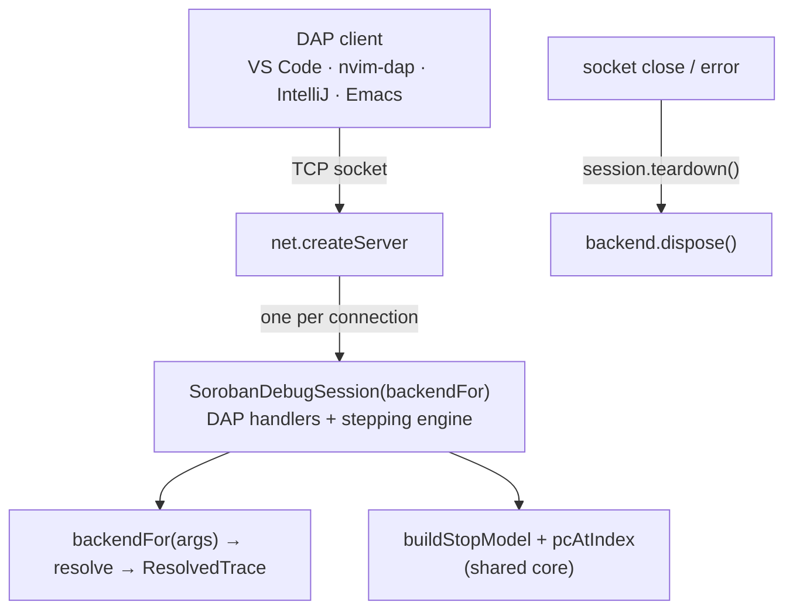

# `soroban-dap` internals

> **Audience:** `contributor` · `maintainer` · `integrator` (internals)
>
> **TL;DR:** How the standalone TCP DAP server wraps `SorobanDebugSession` — one
> session per connection over a socket — plus the backend-selector constructor
> and the per-connection teardown that keeps a dropped connection from leaking a
> `komet-node` process. User-facing usage is in [`dap-cli.md`](./dap-cli.md). The
> `vscode`-free shared core (`backendFor` / `buildStopModel` / `pcAtIndex`) is
> documented in
> [`trace-cli-internal.md`](./trace-cli-internal.md#shared-headless-core).

The server reuses the exact DAP handlers and stepping engine (S1–S20, see
[`stepping.md`](./stepping.md)) the VS Code extension runs — it only changes the
transport from an in-process inline adapter to a TCP socket.

## `startDapServer(opts): Promise<{port, close}>` — `src/server/dapServer.ts`

`startDapServer({ host?, port, backendFor? })` opens a `net.createServer`. For each
connection it:

1. creates `new SorobanDebugSession(select)` where `select` defaults to the shared
   `backendFor` selector (injectable via `opts.backendFor` so tests can observe
   teardown with a spy backend);
2. calls `session.setRunAsServer(true)` (see below);
3. pipes the DAP wire protocol over the socket with `session.start(socket, socket)`;
4. registers `socket.on('close', …)` and `socket.on('error', …)` → `session.teardown()`.

It resolves the **actual** listening port (so `port: 0` yields an OS-assigned port) and
returns `{ port, close }`, where `close()` shuts the server down.

### Per-connection teardown (the two subtleties)

- **`setRunAsServer(true)` is mandatory.** The base `@vscode/debugadapter`
  `DebugSession` calls `process.exit(0)` roughly 100 ms after *any* socket closes
  unless it is in server mode. Without this flag a single client disconnect would kill
  the whole server process (and every other connection with it).

- **`teardown()`, not `shutdown()`.** `DebugSession.shutdown()` is a no-op in server
  mode, so it can't dispose the backend. `SorobanDebugSession.teardown()` is the single,
  idempotent (`disposed`-guarded) place `backend.dispose()` runs. It is reached both by a
  clean `disconnect` request *and* by the socket `close`/`error` handlers — so an
  **abrupt** disconnect (editor crash, network drop, SIGKILL) that sends no `disconnect`
  over the wire still tears down the `LiveBackend`'s `komet-node` subprocess. The
  `disposed` guard makes the second call after a clean disconnect a harmless no-op.

## Session constructor change — `src/debugAdapter/SorobanDebugSession.ts`

`SorobanDebugSession` accepts **either** a concrete `SessionBackend` (unchanged; used by
the extension and the stdio test harness) **or** a selector
`(args: SorobanLaunchArgs) => SessionBackend`, resolved on the first line of
`launchRequest` (the backend is unused before then). The TCP server passes the selector
so the backend can depend on the per-connection launch config, which only arrives with
the client's `launch` request.

## Why TCP, not HTTP

Plain request/response HTTP is intentionally not offered: DAP is a bidirectional,
event-driven protocol (async `stopped`/`output`/`terminated` events) that does not fit
HTTP's request/response shape. TCP is DAP's canonical "server mode", supported by every
mainstream DAP client. A WebSocket transport could be added later for browser-fronted
clients.

`src/server/main.ts` is the thin, coverage-excluded entry: it delegates argv parsing to
the pure `parseServerArgs` (`src/server/cliArgs.ts`, unit-tested), starts the server, and
logs the listening address. Help goes to stdout (exit 0); a usage error goes to stderr
(exit 2).
