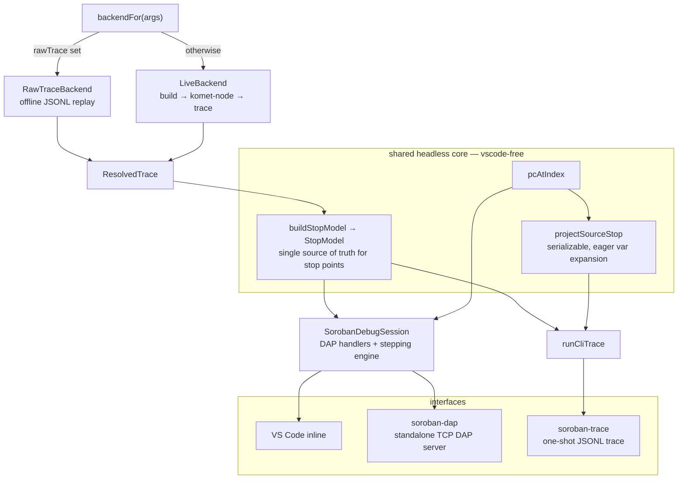

# Debugger interfaces

The trace-replay debug adapter (`SorobanDebugSession`) can be consumed three ways.
All three share one headless, `vscode`-free core; none of them touch the DAP
stepping engine (S1–S20, see [`stepping.md`](./stepping.md)).



## Shared headless core

All modules below are pure (no `vscode`, no DAP wire I/O) and unit-testable.

### `backendFor(args): SessionBackend` — `src/debugAdapter/backendFor.ts`

Selects the trace-acquisition backend from launch args: `args.rawTrace` present →
`RawTraceBackend` (offline replay of a JSONL trace, symbol-rich when `wasmPath` is
also given), else `LiveBackend` (the full build→komet-node→trace pipeline). Extracted
verbatim from the inline selector previously in `extension.ts`; reused by the extension,
the TCP server, and the CLI. Reads only `args.rawTrace`, so it needs no `vscode`.

### `buildStopModel(resolved): StopModel` — `src/debugAdapter/stopModel.ts`

The single source of truth for a trace's stop points, so the IDE and the CLI can never
disagree about where a "stop" is. Given a `ResolvedTrace` it derives, exactly as
`SorobanDebugSession.launchRequest` did inline:

```ts
interface StopModel {
  /** Validated code offset → trace indices (never raw pos; global-init excluded). */
  validatedPosToIndices: Map<number, number[]>;
  /** Visible (validated-position) record indices, ascending. */
  visibleIndices: number[];
  /** Call depth per record (parallel to records), via computeDepths. */
  depths: number[];
  /** Raw line-run starts, pre-S17/S18 (for breakpoint narrowing). */
  rawRunStarts: number[];
  /** Statement-granularity stop points, post-S17/S18 (the source stops). */
  runStarts: number[];
  /** runStarts[0] ?? visibleIndices[0] ?? 0. */
  firstStopPoint: number;
  /** runStarts[last] ?? visibleIndices[last] ?? max(0, records.length-1). */
  lastStopPoint: number;
}
```

Composition (unchanged): `computeDepths(records, positions, disassembly.functionRanges)`
→ `computeRunStarts(positions, depths, i => source.lineKeyForIndex(i))` →
`statementStops(rawRunStarts, depths, i => classifyLineRole(source.sourceTextForIndex(i)))`
(all from `stops.ts`).

### `pcAtIndex(positions, index): number | null` — `src/debugAdapter/stopModel.ts`

The current-PC rule the session uses: the validated code offset at `index`, or the
nearest *earlier* record that has one, else `null`. Keeps variable scope aligned
between IDE and CLI. Extracted from `SorobanDebugSession.currentPc`.

### `projectSourceStop(resolved, stopModel, index, opts): SourceStop` — `src/trace/projectStop.ts`

A **serializable** projection of one stop — NOT shared with the DAP handlers, whose
lazy `Handles`/child-thunk machinery is deliberately different. Reuses only the
low-level resolver calls:

- `source.locationForIndex(index)` → `{path, line, column?}` (or unmapped)
- `pcAtIndex(resolved.positions, index)` → the PC
- `variables.functionNameAt(pc)` → function name (**may be `null`** even with DWARF)
- `makeRuntimeState(record, memoryImage, index)` + `variables.variablesInScope(pc)` +
  `variables.decodeVariable(v, state, pc)` → decoded variables

Children (`DecodedValue.children`) are expanded **eagerly** into plain arrays, bounded
by a per-stop budget: `maxDepth` (default 3), `maxChildren` (default 64), and a global
per-stop node cap (~1500) that appends a `{name:"…", truncated:true}` marker when hit.
Pointer-cycle safety is already handled inside `ValueDecoder`; the budget only bounds
breadth×depth blow-up. A variable with no DWARF name renders as `<anon>` (matching the
DAP handler). `column` may be absent.

```ts
interface SourceStop {
  step: number;            // 0-based ordinal among source stops
  traceIndex: number;      // index into model.records
  depth: number;           // stopModel.depths[traceIndex]
  pc: string | null;       // hex, e.g. "0x2d", or null
  function: string | null; // functionNameAt(pc) or null
  instr: string;           // renderInstr(record.instr)
  source: { path: string; line: number; column?: number } | null;
  variables: TraceVar[];
}
interface TraceVar {
  name: string;            // "<anon>" when DWARF gives none
  type?: string;
  value: string;
  children?: TraceVar[];   // present only when expandable and within budget
  truncated?: boolean;     // marker node when the budget was hit
}
```

## Interface 1 — one-shot CLI (`soroban-trace`) — `src/trace/main.ts` + `runTrace.ts`

`runCliTrace(resolved, opts): string[]` (pure, in `src/trace/runTrace.ts`) walks
`stopModel.runStarts` in order — provably the same sequence a user sees stepping in
(statement-granularity `stepIn` visits `runStarts[0..n]` then terminates per S20) — and
emits kind-tagged JSONL:

```jsonl
{"kind":"meta","function":"add","wasm":"…","records":41,"stops":1,"hasDwarf":true}
{"kind":"stop","step":0,"traceIndex":29,"depth":0,"pc":"0x2d","function":"invoke_raw_extern","instr":"i32.add","source":{"path":"…/examples/adder/src/lib.rs","line":16,"column":9},"variables":[{"name":"arg_0","type":"Val","value":"17179869188"},{"name":"arg_1","type":"Val","value":"12884901892"}]}
{"kind":"result","returnValue":"…","terminated":true}
```

If `stopModel.runStarts` is empty (no DWARF / no source), the CLI errors rather than
silently emitting `visibleIndices` as if they were source statements (an explicit
`--allow-no-source` opt-in may relax this to instruction-level stops later).

`src/trace/main.ts` is a thin, coverage-excluded entry: parse argv, build launch args,
`backendFor(args).resolve(...)`, `runCliTrace`, write to stdout or `--out`, then
`backend.dispose()`. Flags: `--raw-trace <jsonl>` `--wasm <wasm>` (offline, the default
path); or live `--contract <dir> --function <name> [--args-json '[…]']`; plus `--out`,
`--depth`, `--max-children`.

## Interface 2 — standalone TCP DAP server (`soroban-dap`) — `src/server/dapServer.ts`

`startDapServer({host?, port}): Promise<{port, close}>` opens a `net.createServer`; for
each connection it creates `new SorobanDebugSession(backendFor)` (the selector overload)
and pipes `session.start(socket, socket)`. On socket close it calls `session.shutdown()`
so `disconnectRequest → backend.dispose()` runs and a `LiveBackend` komet-node process is
not leaked. This is DAP's canonical "server mode": any DAP client connects to the port
(VS Code `"debugServer": <port>`, nvim-dap, IntelliJ, Emacs dap-mode). `src/server/main.ts`
is the thin, coverage-excluded entry that parses `--host`/`--port` and logs the address.

Plain request/response HTTP is intentionally not offered: DAP is a bidirectional,
event-driven protocol (async `stopped`/`output`/`terminated` events) that does not fit
HTTP's request/response shape. WebSocket could be added later for browser-fronted clients.

## Session constructor change

`SorobanDebugSession` now accepts **either** a concrete `SessionBackend` (unchanged;
used by the extension and the stdio test harness) **or** a selector
`(args: SorobanLaunchArgs) => SessionBackend`, resolved on the first line of
`launchRequest` (the backend is unused before then). The TCP server passes the selector
so the backend can depend on the per-connection launch config.

## Ground-truth fixtures (verified)

Used by the golden tests; `runStarts` is the CLI stop sequence.

| fixture | records | runStarts (source stops) | notes |
|---|---|---|---|
| `adder-debug` | 41 | `[29]` | 1 stop; entry line 16 col 9, fn `invoke_raw_extern`, `arg_0:Val=17179869188`, `arg_1:Val=12884901892` |
| `stepper-debug` | 85 | `[21,27,29,39,44,46,56,61,63,73]` | 10 stops, 2 functions; idx 29 → fn `triple`, line 15, **no column**, `x:u32=0` |
| `increment-debug` | 2717 | `[646,999,1454,1904,1956,2495]` | 6 stops; idx 999 → line 21, `current:u32=15`, `env:Env` (expandable); some vars **unnamed** and `functionNameAt`→`null` |

Fixtures live in `test/fixtures/<name>.trace.jsonl` + `<name>.wasm`. The adder's DWARF
resolves to `examples/adder/src/lib.rs`.
