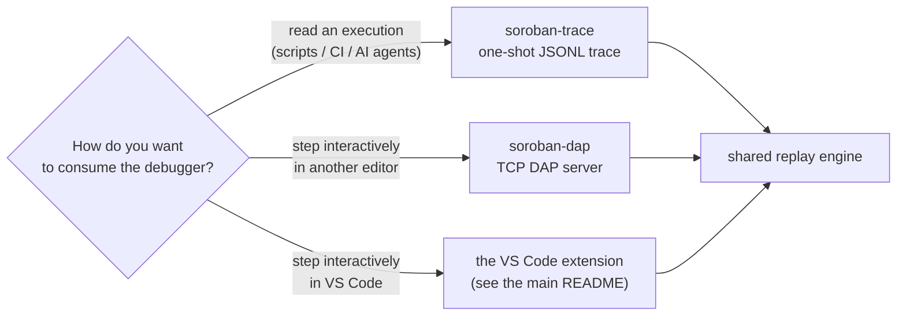

# Standalone interfaces: CLI trace & DAP server

> **Audience:** `soroban developer` (outside VS Code) · `CI / scripting user` ·
> `AI agent integrator` · `other-editor user`
>
> **TL;DR:** How to use the debugger without VS Code. `soroban-trace` prints a
> Rust-source-level execution trace as JSONL (for scripts, CI, and agents);
> `soroban-dap` serves the debug adapter over TCP so nvim-dap/IntelliJ/Emacs can
> drive it. Includes building the tools, offline & live usage, and every flag.

Besides the VS Code extension, the debugger ships two standalone command-line
tools for using it **outside the editor**:

- **`soroban-trace`** — a one-shot CLI that prints a Rust-source-level execution
  trace as JSONL. Built for scripts, CI, and AI agents that want to *read* an
  execution rather than step through it interactively.
- **`soroban-dap`** — the debug adapter served over a TCP socket, so debuggers
  *other* than VS Code (nvim-dap, IntelliJ, Emacs `dap-mode`, …) can drive it.

Both are thin front-ends over the same replay engine the extension uses; see
[`interfaces.md`](./interfaces.md) for the internal design and the full JSONL
schema.



## Building the tools

```sh
npm install
npm run build
```

This produces `dist/trace.js` and `dist/dap-server.js`. Run them directly with
`node dist/trace.js …` / `node dist/dap-server.js …`, or expose them as the
`soroban-trace` / `soroban-dap` commands by installing the package
(`npm install -g .`, or `npm link` for local development).

The **offline** examples below need no toolchain. Live mode (building and running
a contract) needs the same tools as the editor — the [Stellar
CLI](https://developers.stellar.org/docs/tools/cli) and
[komet-node](https://github.com/runtimeverification/komet-node) on your `PATH`
(see the [main README](../README.md#requirements)).

---

## `soroban-trace` — Rust-level execution trace as JSONL

Emits one JSON object per line: a leading `meta` record, one `stop` per
source-level statement (in execution order), and a trailing `result`.

### Quick start (offline replay of a recorded run)

```sh
node dist/trace.js \
  --raw-trace test/fixtures/adder-debug.trace.jsonl \
  --wasm      test/fixtures/adder-debug.wasm
```

```jsonl
{"kind":"meta","wasm":"test/fixtures/adder-debug.wasm","records":41,"stops":1,"hasDwarf":true}
{"kind":"stop","step":0,"traceIndex":29,"depth":0,"pc":"0x2d","function":"invoke_raw_extern","instr":"i32.add","source":{"path":".../examples/adder/src/lib.rs","line":16,"column":9},"variables":[{"name":"arg_0","type":"Val","value":"17179869188"},{"name":"arg_1","type":"Val","value":"12884901892"}]}
{"kind":"result","terminated":true}
```

Each `stop` carries the source location, the enclosing function, the call
`depth`, the wasm `pc`/`instr`, and the in-scope variables decoded from DWARF
(aggregates expand into a nested `children` array, bounded by `--depth` /
`--max-children`). The full `SourceStop` / `TraceVar` field reference is in
[`interfaces.md`](./interfaces.md).

### Live mode (build → deploy → run → trace)

```sh
node dist/trace.js --contract ./path/to/crate --function add \
  --args-json '[{"value":1,"type":"u32"},{"value":2,"type":"u32"}]' \
  --out trace.jsonl
```

### Flags

| Flag | Description |
|------|-------------|
| `--raw-trace <file>` | Replay a recorded JSONL trace (offline). Pair with `--wasm` for source/variables. |
| `--wasm <file>` | Contract `.wasm` supplying the DWARF debug info (source lines + variables). |
| `--contract <dir>` | Live mode: crate directory to build, deploy, and run. |
| `--function <name>` | Live mode: contract function to invoke. |
| `--args-json <json>` | Function arguments, e.g. `'[{"value":1,"type":"u32"}]'`. |
| `--out <file>` | Write JSONL to a file instead of stdout. |
| `--depth <n>` | Max variable-expansion depth (default 3). |
| `--max-children <n>` | Max children materialized per aggregate (default 64). |
| `--allow-no-source` | Don't error when the trace has no DWARF source stops. |

If the trace has no Rust source-level stops (no matching `--wasm`, or a
non-debug build) the command exits non-zero with a message, rather than emitting
a misleading trace — pass `--allow-no-source` to override.

---

## `soroban-dap` — standalone DAP server over TCP

Runs the debug adapter as a TCP server (DAP's canonical "server mode"). Each
client connection gets its own independent session; the launch configuration is
sent by the client over the wire, exactly as in the editor.

```sh
node dist/dap-server.js --port 4711
# → Soroban DAP server listening on 127.0.0.1:4711
```

| Flag | Description |
|------|-------------|
| `--port <n>` | TCP port to listen on (default `4711`). |
| `--host <addr>` | Interface to bind (default `127.0.0.1`, loopback only). |

The server binds **loopback** by default — it does not expose the debugger to
the network. Only override `--host` on a trusted, isolated network.

### Connecting a client

Any DAP client that can attach to a running server works. From VS Code, point a
launch configuration at the port with `debugServer`:

```jsonc
{
  "type": "soroban",
  "request": "launch",
  "name": "Attach to soroban-dap",
  "debugServer": 4711,
  "rawTrace": "test/fixtures/adder-debug.trace.jsonl",
  "wasmPath": "test/fixtures/adder-debug.wasm"
}
```

Other editors use their own attach mechanism (e.g. nvim-dap's `server`/`port`
adapter config) — the wire protocol is standard DAP, so any conformant client
can drive it. The full set of launch attributes is the same as the editor's
[configuration reference](../README.md#configuration-reference).

> Plain request/response HTTP is intentionally not offered: DAP is a
> bidirectional, event-driven protocol that doesn't fit HTTP's request/response
> shape. A WebSocket transport could be added if a browser-based client needs one.
